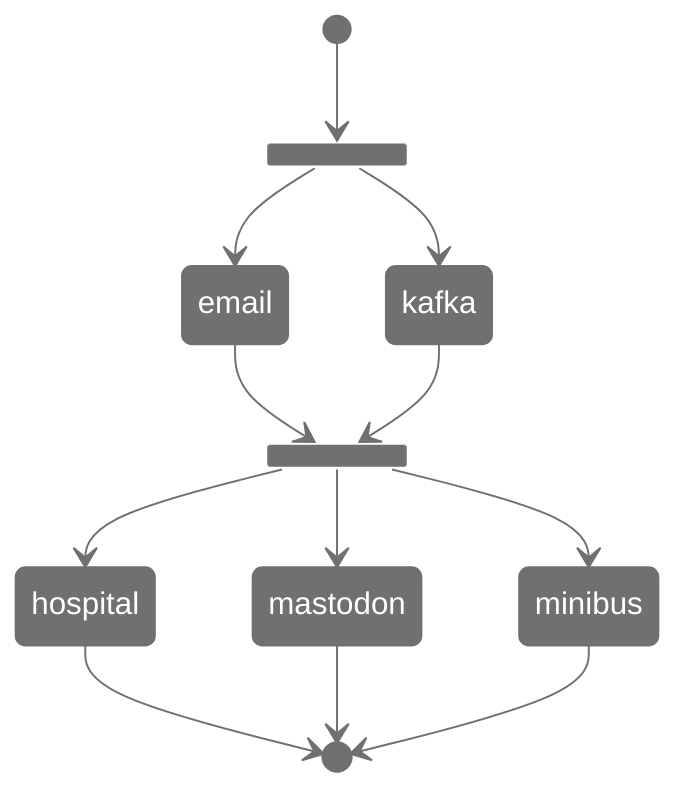

# Playbook batches

`ansible/playbooks/plays_to_run.yml` is structured around *batches* of playbooks:

```yaml
batches:
  batch1:
    - container_projects/deploy_email.yml
    - container_projects/deploy_kafka.yml
  batch2:
    - container_projects/deploy_hospital.yml
    - container_projects/deploy_mastodon.yml
    - container_projects/deploy_minibus.yml
```

Playbooks in the same batch will run concurrently, and playbooks in subsequent batches will not start until previous batches are done:



## Sequential execution

To execute playbooks in sequence, set `asynchronous: false`:

```yaml
asynchronous: false
batches:
  batch:
    - container_projects/deploy_email.yml
    - container_projects/deploy_hospital.yml
    - container_projects/deploy_mastodon.yml
```

Batches have no effect under sequential execution.
